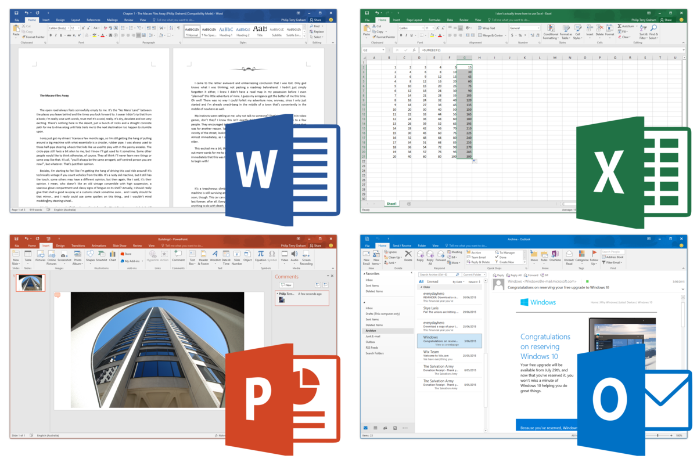
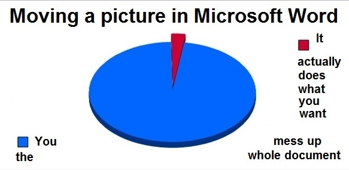

```{r setup, include=FALSE}
# For making transparent ggplot2 graphs, from https://gist.github.com/cboettig/5600558 

# Set plotting to bw plot default, but with transparent background elements.  
# Note transparency requires the panel.background, plot.background, and device background all be set!
library(ggplot2) 
theme_set(theme_bw(base_size=12))
theme_update(panel.background = element_rect(fill = "transparent", colour = NA),
             plot.background = element_rect(fill = "transparent", colour = NA))
knitr::opts_chunk$set(dev.args=list(bg="transparent"))
```

**Note to Students**: This guide is available on [my website](http://ryansafner.com/tutorial/RMDG.html), which Blackboard will link to. The source files are also available [on GitHub](http://github.com/ryansafner/RMDG)

**Note to Everyone Else**: This guide is oriented primarily for my [Econometrics class](http://ryansafner.com/courses/econ480) at Hood College, but should be of wider use to anyone interested in learning `R` for data analysis. Lecture slides, handouts, and guides (both PDFs and source code in R Markdown) are openly available [on GitHub](http://github.com/ryansafner/ECON480/).

**See also my companion guide to using R** hosted on [my website](http://ryansafner.com/tutorial/R4EH.html), with source available also [on GitHub](http://github.com/ryansafner/R4EH)

# Manage Your Workflow

- Your workflow has a lot of moving parts: 

1. Writing Text
2. Managing citations and bibliography
3. Performing data analysis
4. Making figures and tables 
5. Save files for future use 
6. Monitor changes in documents 
7. Collaborate and share files with coauthors
8. Combine all elements into single document for presentation

- You are used to "**the Office Model**"



1. Writing Text
    - Done in Word, the "realest" part of your workflow 
2. Managing citations and bibliography 
    - Often done by hand in Word, perhaps a reference manager plugin
3. Performing data analysis 
    - Done in Excel (possibly Stata/SAS/R), then copy/pasted into Word
4. Making figures and tables 
    - Done in Excel (possibly Stata/SAS/R), then copy/pasted into Word
5. Save files for future use
    - Save Word .docx, Excel .xlsx, etc. 
6. Monitor changes in documents
    - Track changes inside Word file
7. Collaborate and share files with coauthors
    - Email Word .docx to collaborators, they email back different files, merging, resolving conflicts, etc.
        - `paper.docx`, `paper2.docx`, `paper2comments.docx`, `paper2edits.docx`, `paperfinal?.docx`, etc.
    - Google Docs a vast improvement but at cost of word processing sophistication
- Combine all elements into single document for presentation
    - Copy/paste everything into Word
    - Possibly export as a PDF 
    - Possibly make additional slides in Powerpoint

https://www.youtube.com/watch?v=s3JldKoA0zw

### The Problem with WYSIWYG 



- MS Office is a set of [**"What You See is What You Get (WYSIWYG)"**](https://en.wikipedia.org/wiki/WYSIWYG) editing programs
- You will never understand the actual **structure** of your document, only **what it looks like** 
- Waste more time on formatting and aesthetics than actual writing of the content! 

### Caveats for What I'm About to Show You


- "If it ain't broke, don't fix it"
- I will only offer suggestions that I:
    - Use myself
    - Will make guides and tutorials for you
    - Can answer your questions about 
- Nothing here is mandatory: if you like your Office model, you can keep it 
- You just probably never realized there are better alternatives

# The Alternative: Plain Text Files + Automation 

- Why not have a single program and file to accomplish the following? 

1. Writing Text
2. Managing citations and bibliography
3. Performing data analysis
4. Making figures and tables 
5. Save files for future use 
6. Monitor changes in documents 
7. Collaborate and share files with coauthors
8. Combine all elements into single document for presentation

Meet `R Markdown`, a **plain-text** file that weave together all 8 elements in a single document and file 


## Plain Text Files

- **Plain text** files are meant to be readable by *both* machines and humans
    - Can understand how a document is structured and formatted via code implemented by program 
    - Again, proper commenting helps humans understand what code does
- Allows your typing to focus entirely on the content and structure, leave aesthetics to the professionals 
    - Can still customize the aesthetics with a simple set of precise ommands rather than click, drag, guess, and pray
- **Benefits of Open source**: free, useable forever, usually very small file size! 
    - Proprietary software is often larger and may be unusable 20 years from now
        - Try opening a `.doc` from Microsoft Word '97 in Microsoft Word today 
- Minimize error and risk of loss, especially in otherwise repetitive processes
    - Make you computer work for you by automating as much as possible

## Making Your Work Reproducible

> One day you will need to quit R, go do something else and return to your analysis the next day. One day you will be working on multiple analyses simultaneously that all use R and you want to keep them separate. One day you will need to bring data from the outside world into R and send numerical results and figures from R back out into the world. To handle these real life situations, you need to make two decisions:
What about your analysis is "real", i.e. what will you save as your lasting record of what happened?
Where does your analysis "live"? 
- Hadley Wickham, [R For Data Science](http://r4ds.had.co.nz/workflow-projects.html)

- Simple `R` command line input is not real, not saved, not reproducible
    - We've talked about `.R` script files -- these are real and saved (and commented!)
- Now your `R Markdown` `.Rmd` file is the "real" part of your analysis, *everything* can live in this file 
    - Often called **notebooks**: allows you to insert **chunks** of `R` code that you can run individually
        - Open source code notebooks are the future of science! See [The Atlantic article](https://www.theatlantic.com/science/archive/2018/04/the-scientific-paper-is-obsolete/556676/) and [Paul Romer's comments](https://paulromer.net/jupyter-mathematica-and-the-future-of-the-research-paper/?fbclid=IwAR12yWdZxT07qGGqfcxrsZzeCLK6f5EB0sslYXK1GZHpVCZm_h-4rTiHwSg)
    - `CTRL` (`Cmd` on Mac)`+Option+I` creates a new chunk (see below)
- You download and run my code and you will get the same outcome as me, *every time* 

# Creating an `R Markdown` Document

- `File -> New File -> R Markdown...`
- Options: 


## Document Types

- Two main options: `html` and `pdf`
    - Other types, for presentations: `beamer`, `ioslides`, `slidy` (I use `beamer`)
- `html`: renders a webpage, viewable on any browser
    - the default, easiest to produce and share
    - can create interactive elements (gifs, plots, animations)
    - requires internet connection
- `pdf`: renders a pdf document, viewable in any pdf viewer
    - most common document format around
    - may require `LaTeX` distribution to render 
    - can't create interactive elements
- `word` is there if you absolutely need it, I reccomend against it 

## Structure of a `R Markdown` Document

- Your entire document is written in a single file, including: 
    1. The YAML header for metadata
    2. The actual **text** of your document (i.e. the content of a paper, slides for a presentation, homework assignment, etc) 
        - Written using (`R`'s "flavor" of) the **markdown** language
    3. `R` chunks for data analysis and plots, figures, and tables as necessary 

### YAML Header

- The top of a document contains the `YAML`, separated by `---` above and below
    - FYI: "YAML" recursively stands for "YAML Ain't Markup Language"
- Contains the *metadata* about a document, at minimum the `title`, `author`, and `date` (all can be left blank), and the `output` type (which cannot be blank)
    - `output` types: pdf document, html document, pdf slides (beamer), html slides (ioslides, slidy)
- Can be customized extensively (just look at mine)
    - making slides often requires more customization vs. making a pdf/html document 
- In most cases, you can ignore the header until you are ready for major customization
    - In my experience, I find I customize the most when I make slides (i.e. look at the header for these slides!);

[](images/yamlex1)

### R Chunks

- You can create a "chunk" of `R` code with three backticks (the key next to \#1 key) above and below your code
    - After the first pair of apostrophes, signify you want to use `R` with `{r}` 
    - You can choose to name your chunk (for your own reference only) with a comma after `r` in the brackets, and then your name (no spaces!)
    - You can then add additional options (with a comma after `r`), frequently used:
        - `echo=TRUE` or `FALSE`, only displays `R` outputs if `FALSE`; also displays the code *inputted* if `=TRUE`
        - `eval=TRUE` or `FALSE`, if you want to display your code, but *not run it* 
        - `fig.height` and/or `fig.width` = a number, for displaying figures in documents
        - `results=asis` common for exporting tables (like `stargazer` regression outputs) into `.tex` or `html` 
    - See [this guide](https://yihui.name/knitr/options/) for a full list
- If you just want to display code into your document/slides (and not run it), one backtick on either side of the code, `like this`
    - You can also *actually* run the `R` code in text if the first character after the backtick is `r`, for example:
```{r}
x<-c(1,2,3,4,5)
sd(x)
```

if I then type "r sd(x)" in backticks, it will print `r sd(x)` in my text. 

### Markdown Language and Syntax 

- [Markdown](https://en.wikipedia.org/wiki/Markdown) is a lightweight markup language geared towards HTML (i.e. the internet)
    - [Markup languages](https://en.wikipedia.org/wiki/Markup_language) used to add commands about how to display plain text
- Very simple and intuitive
- Write normal text as usual in any word processor 
- Change font styling with tags (asterisks): 
    - `*italics text*` creates *italics text*
    - `**bold text**` creates **bold text** 
- Create an unordered list with lines of (- or + or * ), e.g.: 

```
- item 1
- item 2
- item 3
```

Creates

- item 1
- item 2
- item 3

- Create an ordered list with 

```
1. first 
2. second
3. third
```

Creates

1. first
2. second
3. third

- Section headings are created by a hashtag `#` at the front of a line
    - e.g. `# My Title` creates a main heading 
    - more hashtags creates subheadings, e.g. `## My Sub-Heading Title` 
- You can write comments in your file that will not print in the final version with `<!--` (this comes from html)
    - e.g. `<!-- my comment` would not print in the output 

- Make a nice simple table with 

```markdown

| Header 1 | Header 2 | 
|----------|----------|
| Cell 1   | Cell 2   |
| Cell 3   | Cell 4   |
```

| Header 1 | Header 2 | 
|----------|----------|
| Cell 1   | Cell 2   |
| Cell 3   | Cell 4   |

- Tips
    - Use `|` to act as column dividers
    - Column `|`s do not have to line up (but it's easier to read the markdown code)
    - Must have at least four `----` to properly align columns 
- We can make much more complex tables with $\LaTeX{}$ (see below)
- Add beautifully-formatted math with the `$` tag before and after the math, two `$$` before/after for a centered equation
- In-line math example: `$1^2=\frac{\sqrt{16}}{4}$` produces $1^2=\frac{\sqrt{16}}{4}$

- Centered-equation example: `$$\hat{\beta_1}=\frac{\displaystyle \sum_{i=1}^n (X_i-\bar{X})(Y_i-\bar{Y})}{\displaystyle \sum_{i=1}^n (X_i-\bar{X})^2}$$` produces: 

$$\hat{\beta_1}=\frac{\displaystyle \sum_{i=1}^n (X_i-\bar{X})(Y_i-\bar{Y})}{\displaystyle \sum_{i=1}^n (X_i-\bar{X})^2}$$

- Math uses a (much older) language called $\LaTeX{}$, used by mathematicians, economists, and others to write papers and slides with perfect math and formatting
    - I used to use for everything before I found `R` and `markdown` 
    - Much steeper learning curve, [a good cheatsheet](https://wch.github.io/latexsheet/latexsheet.pdf)
    - An extensive library of mathematical symbols, notation, formats, and ligatures, e.g.

| Input | Output |
|----|----|
| `$\alpha$` | $\alpha$ |
| `$\pi$` | $\pi$ | 
| `$\frac{1}{2}$` | $\frac{1}{2}$ | 
| `$\hat{x}$` | $\hat{x}$ | 
| `$\bar{y}$` | $\bar{y}$ | 
| `$x_{1,2}$` | $x_{1,2}$ | 
| `x^{a-1}$` | $x^{a-1}$ |
| `$\lim_{x \to \infty}$` | $\lim_{x \to \infty}$ | 
| `$A=\begin{bmatrix} a_{1,1} & a_{1,2} \\ a_{2,1} & a_{2,2} \\ \end{bmatrix}$` | $A=\begin{bmatrix} a_{1,1} & a_{1,2} \\ a_{2,1} & a_{2,2} \\ \end{bmatrix}$ | 

- A great resource: [Wikibooks LaTeX Mathematics chapter](https://en.wikibooks.org/wiki/LaTeX/Mathematics)

### Citations, References, and Bibliography

- Manage your citations and bibliography automatically with `.bib` files 
- First create a `.bib` file to list all of your references in
    - You can do this in `R` via: File -> New File -> Text File (and save with `.bib` at the end)
    - See `examplebib.bib` in this repository used in this document 
    - At the top of your `YAML` header in the main document, add `bibliography: examplebib.bib` so `R` knows to pull references from this file 
    - For each reference, add information to a `.bib` file, like so: 

```
@article{safner2016,
  author = {Ryan Safner},
  year = {2016},
  journal = {Journal of Institutional Economics},
  title = {Institutional Entrepreneurship, Wikipedia, and the Opportunity of the Commons},
  volume = {12},
  number = {4},
  pages = {743-771}
}
```
- Can do the same for `@article`, `@book`, `@collectedwork`, `@unpublished`, etc. 
    - Each will have different keys needed (e.g. `editor`, `publisher`, `address`)
    - The first term after the `{` is your **citation key** (e.g. `safner2016`)
- Whenever you want to cite a work in your text, call up the citation key with `@`, like so: `@safner2016[]`, which produces @safner2016[]
    - You can customize citations, e.g.:
        - All in parentheses: `@[safner2016]` produces @[safner2016]
        - No parentheses: `@safner2016` produces @safner2016
        - Date only: `[-@safner2016]` produces [-@safner2016]
        - Adding pages or comments: `@safner2016[743-744 and passim]` produces @safner2016[743-744 and passim]
- BibTeX will automatically collect all works cited at the end and produce a **bibliography** according to a style you can choose
    - See the \textbf{References} automatically produced at the end of this document 
- For more information and examples, see [R Studio's R Markdown Guide on Bibliographies](https://rmarkdown.rstudio.com/authoring_bibliographies_and_citations.html)
- Lot of programs can help you manage references and export complete `.bib` files to use with `R Markdown`
    - [Mendeley](https://www.mendeley.com) and [Zotero](https://www.zotero.org/) are free and cross-platform
    - I use [Papers](https://www.readcube.com/papers/) (Paid and Mac only)
    - The simplest program (which I also use), which only makes `.bib` files is [Bibdesk](https://bibdesk.sourceforge.io/)
    
### Plain Text Editors

- Markdown files are [**plain text**](https://en.wikipedia.org/wiki/Plain_text) files and can be edited in *any* text editor
    - something as basic (and boring!) as "**Notepad**," for example
    - many good [text editors](https://en.wikipedia.org/wiki/Text_editor) out there: [Notepad++](https://notepad-plus-plus.org/), [Sublime](https://www.sublimetext.com/), etc. 
    - `R Studio` is a great plain text editor too (I write everything in `R Studio`)
        - Can make any file type via File -> New File -> Text File (and add your own file extension type when saving)

{width=4.5in} {width=4.5in}

- Any good text editor worth its salt should have *syntax highlighting*, coloring text that is styled (e.g. **bold**, *italic*, comments, `R code`, etc) differently from plain text (so you can spot it easily!)

### Syntax Tips

- Empty space is very important in markdown 
- Lines that begin with a space may not render properly
- Moving from one type of content to another (e.g. a list to text to an equation to text) requires need blank lines between them to work 
- Here is a [great general tutorial on markdown syntax](https://www.markdowntutorial.com/)


### Compiling Your Output with `knitr` 

- When you are ready, you will want to export your `R Markdown .Rmd` document with raw code to a conventional document format (e.g. `.pdf`, `.docx`, `html`)
- You do this by `knit`ing your code with `knitr` and `pandoc`
    - [pandoc](http://pandoc.org) is a "swiss-army knife" utility that can convert between dozens of document types 
    - The `knit` button converts your (R-flavored Markdown) `Rmd` file into a plain Markdown `md` file, and then uses pandoc to convert into conventional formats (see figure below)
        - Note by clicking on the `knit` button, you can choose what format you wish to convert to (often `HTML` `PDF` or `Word`)
        - This may depend on what you initially chose when you created your `Rmd` file in `R`
        - Don't worry, you can change or modify this choice at any time
        - Notice in your `YAML` header, the `output:` line which determines what to `knit` to 


- `knit`ing to pdf files requires a TeX distribution (remember we talked about LaTeX for math) to be installed on your computer
    - this utility actually is what "compiles" your code (transformed into a `.tex` file by `knitr`) into a PDF document
    - you must first download and install a TeX distribution, such as [MikTeX](https://miktex.org/download)
    - **Note for Trading Room Computers**: I have found the following method to work: 
```{r, eval=FALSE}
# First we need To install tex (MikTex for Windows)

# Second we need to install devtools in R
install.packages("devtools")
#this allows us to download packages directly from GitHub

# Third we need to install an older version of R Markdown 
# (that apparently works with the Trading Room Computers)

devtools::install_version("rmarkdown", version = "1.8", repos = "http://cran.us.r-project.org")

# Source: https://github.com/rstudio/rmarkdown/issues/1285

# Next, Restart R. 

# When you knit a PDF for the first time, it may ask you to download other packages, approve them. 
```

# Resources

Resources to read in rough order of importance and level of sophistication (most important-least sophisticated to least important-most sophisticated)

1. R Studio's [R Markdown Cheatsheet](https://www.rstudio.com/wp-content/uploads/2015/02/rmarkdown-cheatsheet.pdf) for a quick overview of R markdown 
2. R Studio's [Overview of R Markdown](https://rmarkdown.rstudio.com/) for some tutorials 
3. R Studio's [R Markdown Reference Guide](https://www.rstudio.com/wp-content/uploads/2015/03/rmarkdown-reference.pdf) for more specific options and issues
4. Kieran Healey's [The Plain Person's Guide to Plain Text Social Science](http://plain-text.co) on managing workflow with plain text files, R, and Git
5. Yihui Xie's (and coauthors) [R Markdown: the Definitive Guide](https://bookdown.org/yihui/rmarkdown/) on R Markdown syntax and customization options
6. Hadley Wickham's (and Garrett Grolemund) [R for Data Science](http://r4ds.had.co.nz/) on how to use R and R Markdown for data science work
7. Jenny Bryan's [Happy Git with R](http://happygitwithr.com/) on how to use git and GitHub with R as a version control system

# References 